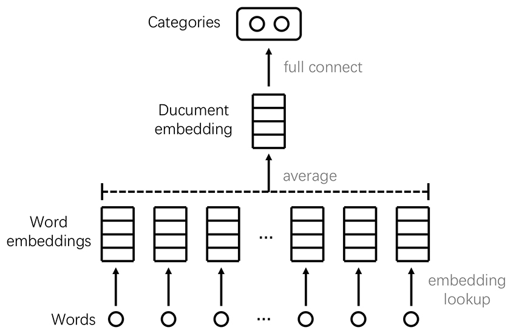
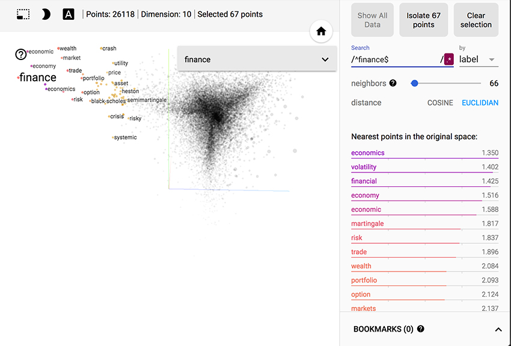
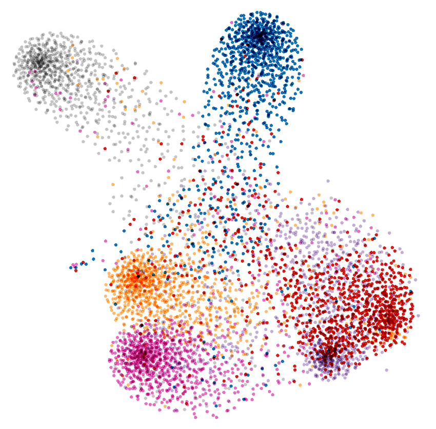

# Papers Classification and Visualization

## 1 Introduction

This lab focus on introducing the basic nlp methods and implementing them on a specific topic, to classify and visualize papers. In this lab, you will learn some basic concepts and steps in natural language processing and realize them using Python. Moreover, you will use Tensorflow to build your model and Tensorboard to visualize the results.

### 1.1 Documents Classification

Documents classification is a fundamental task in natural language processing. Traditional classification methods relies on feature engineering based on bag-of-words, production rules and linguistically-informed features. Since Mikolov opened [word2vec][1] source code in 2013, the concept of embedding facilitates our classification task a lot. Recently, neural network based classification models greatly outperform previous linear models with hand-crafted sparse features. 

### 1.2 A Simple Classification Model

Firstly, we introduce FastText, which may be one of the simplest models that utilize word embeddings.



Figure 1. Model architecture of FastText

FastText is used as the baseline of this lab. Figure 1 shows the architecture of FastText. An embedding lookup table is randomly initialized and updated through training.  Through embedding lookup layer, each word in a document is transferred to word embedding. The word representations are then averaged into a text representation, which is in turn fed to a linear classifier. More introductions of FastText can be found in [2].

### 1.3 Complex Classification Models

We introduce more complicated models here. n-gram rather than single word can be used in FastText. [One dimensional cnn][3] is a good tool for synthesizing meaning of a document. [Rnn with attention mechanism][4] can also be used in classification. We can use [pre-trained word representations][1] to initialize lookup table. 

### 1.4 Goals of this Lab

The basic requirements of this lab are:
- Use the given training set to train a basic FastText model; 
- Visualize trained word embeddings and paper embeddings;
- Write experiment report by LaTeX.

The bonus of this lab are:
- Choose one of the complex models or conceive your own model, implement it;
- Get an accuracy over 90%.

## 2 Get Ready

### 2.1 Installation of Python

You can download Python in <https://www.python.org/downloads/>.

### 2.2 Installation of TensorFlow and TensorBoard

You can refer to <https://www.tensorflow.org/install/> for installation.

### 2.3 Installation of NLTK

NLTK is a natural language toolkit of python. Punkt is a package of NLTK and used to parse sentences. After installing NLTK, you can run python, import NLTK module and run nltk.download() to download needed NLTK packages.

### 2.4 Download Dataset and Example Code

In this experiment, we provide a training set, a validating set and a testing set. Testing set is only used to test trained models. Using testing set to control training procedure is considered as cheating.

Each set is in CSV form and self-explanatory. The testing set also has a TSV form, which is used as the metadata file for embedding visualization in TensorBoard.

You need to install python2 to run the example code.You need to upgrade TensorFlow and TensorBoard to their newest versions to run our example code. 
The dataset and example code can be downloaded here.

## 3 Experiment Procedure

### 3.1 Preprocessing

Title and abstract are concatenated and treated as the content of paper. Then we count words and build vocabulary. There are multiple ways of extracting words. You can tokenize text and treat numbers and punctuations as words too, or you can use regular expression to split sentences and filter numbers and punctuations. Also you can transform words to their lower cases and filter words with sparse occurrences.

After building vocabulary, you should represent words with their indices in vocabulary so that can be fed to a TensorFlow model. Categories should also be transformed to indices so that they can be fed to model too.

### 3.2 Building and Training Your Model

We have provided you with simple FastText model. You can implement a cnn model, a rnn model or simply conduct improvements on the simple FastText model.

To run the provided example model, go to the downloaded folder:

```bash
python main.py
```

You can customize hyper-parameters and specify that the model should be retrained:

```bash
python main.py --embedding_size 20 --batch_size 64 --retrain True
```

### 3.3 Embedding Visualization

You can use TensorBoard to visualize word embeddings and paper embeddings. In FastText, we average word embeddings to fetch paper embeddings. So we can infer that stop words, such as have, are, to and et al, should have smaller embeddings; while terminologies, which are closely related to their certain categories, should have larger embedding vectors. Also we can infer that terminologies belong to the same category will lay together.



Figure 2. Word embedding visualization



Figure 3. Paper embedding visualization

If './save/' is the folder which contains check-point file, to run TensorBoard:

```bash
tensorboard --logdir save
```

Then open your browser and open link localhost:6006.

For more details, you can refer to <https://www.tensorflow.org/get_started/embedding_viz>. 

## 4 Write Report

- Brief introduction of your work.
- Which model did you use to realize your classifier, and why?
- The parameters you have chosen in your models, and why you chosen them?
- Analyses of your visualization results.
- Draw a confusion matrix and analyze reasons for misclassifications.
- If you get accuracy higher than 90%, please write it down.(Bonus)